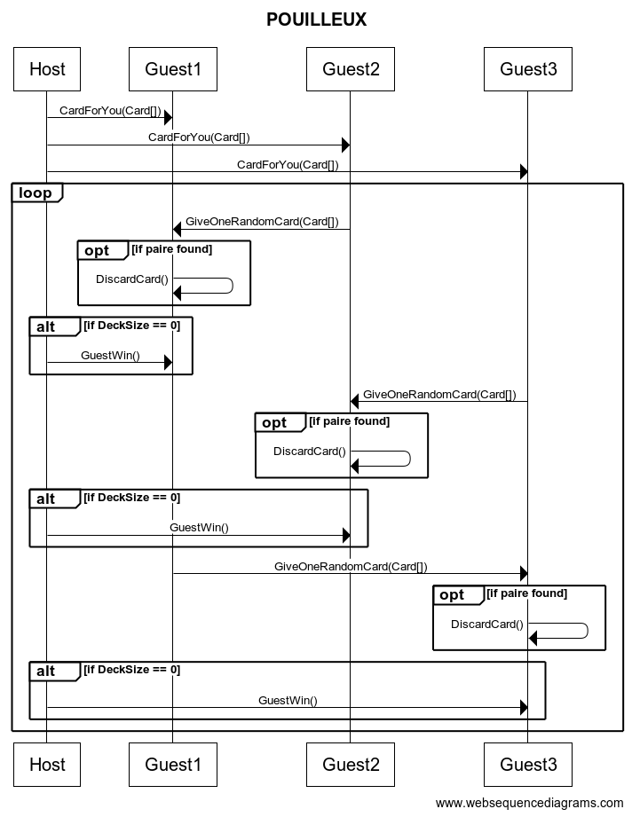

# L3_POO_REGLES

# Règles
Le jeu se joue à trois joueurs et comporte un maître du jeu.

## Mise en place
Jeu de 51 cartes sans le Valet de trèfle. Jeu divisé en 2 (J1 = 25 / J2 = 26).

## Déroulé de la partie
Le maître du jeu commence par regarder les paires dans son jeu et ensuite pioche une carte dans le jeu du joueur 2.
Le maître du jeu vérifie si la partie est terminée. Si c'est le cas, il en informe son adversaire.

## Fin de la partie
La partie est terminée lorsqu'un des joueurs n’a plus de cartes en main, il est donc déclaré vainqueur.

# Détail des classes principales
* JackHost classe exécutable représentant le maître du jeu
* JackGuest classe exécutable représentant l'adversaire du maître du jeu
* JackStandAlone jeu local.

# Protocole réseau
> Le protocole réseau définit les séquences des commandes échangées entre les différentes parties prenantes. Il doit contenir, pour chaque commande, l'expéditeur, le destinataire, le nom de la commande et le contenu du corps de la commande.

# Diagramme des classes

