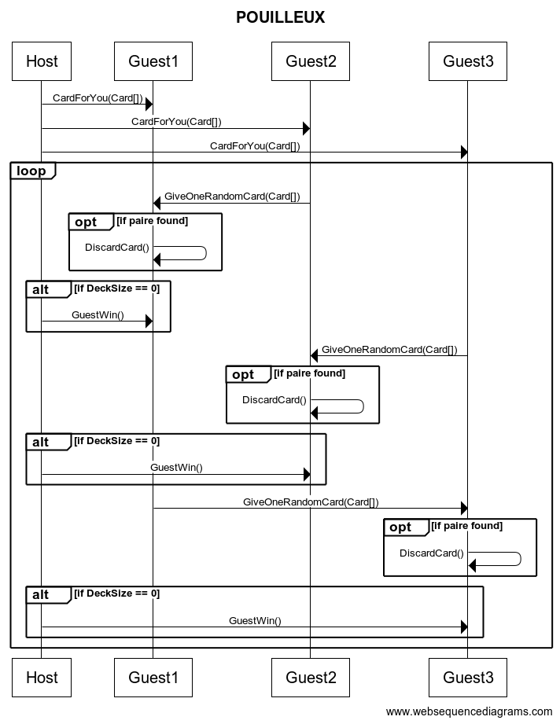

# L3_POO_REGLES

# Règles
Le jeu se joue de 2 à 8 joueurs et comporte un maître du jeu.

## Mise en place
Jeu de 51 cartes sans le Valet de trèfle. Le maître du jeu distribue toutes les cartes aux joueurs de manière équitable (Ex Si 2 joueurs J1 = 25 / J2 = 26).

## Déroulé de la partie
Le maître du jeu commence par distribuer les cartes aux joueurs. 
Chaque joueur commence par regarder son jeu et retire les paires qu’il possède. 
Une paire est une combinaison de 2 cartes en fonction de leurs chiffres et couleur communes (Ex 2 de cœur et 2 de carreau). 
Les cartes défaussées sont mises de côté et ne sont plus utilisées. 
Le premier joueur pioche une carte dans le jeu du joueur suivant et revérifie s'il a des paires dans son jeu. 
Le maître du jeu vérifie si la partie est terminée à chaque tour de joueur, c'est-à-dire lorsqu'un des joueurs n'a plus de cartes en main. 
Si c'est le cas, il arrête la partie. 
Ensuite, le prochain joueur pioche dans le jeu du joueur suivant.

## Fin de la partie
La partie est terminée lorsqu'un des joueurs n’a plus de cartes en main, il est donc déclaré vainqueur. Si la partie se joue à plus que deux joueurs, le joueur ayant le valet de pique est déclaré grand perdant.

# Détail des classes principales

# Protocole réseau
> Le protocole réseau définit les séquences des commandes échangées entre les différentes parties prenantes. Il doit contenir, pour chaque commande, l'expéditeur, le destinataire, le nom de la commande et le contenu du corps de la commande.

# Diagramme des classes

